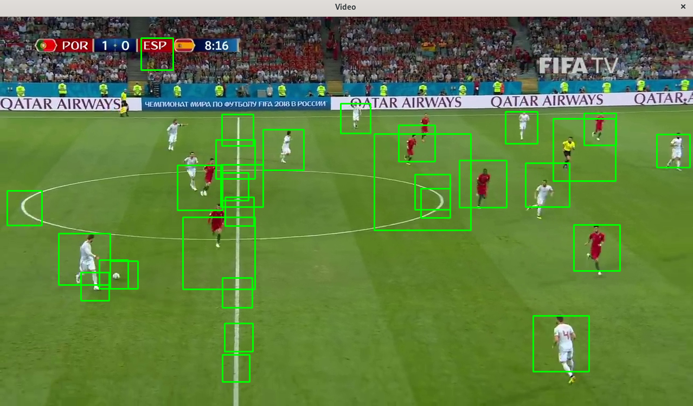

# Football player detection using opencv haar cascade

Run with
> python football.py

Trained with 290 positive images and about 3400 annotations and 750 negative images.

Gives a alot of false positives See image.
  

